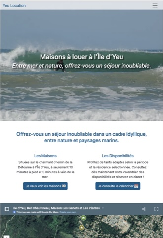
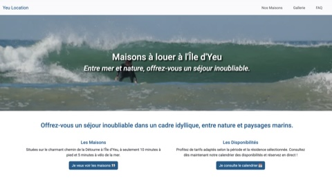

# Air, a theme for [Hugo](https://gohugo.io/), a framework for building websites.

The intent of this theme is to provide a solid starting place for Hugo sites with basic features and include best practices for performance, accessibility, and rapid development.

## Screenshot

 ### Mobile

 
 ### Desktop


## Demo

[DEMO SITE](https://yeulocation.ducatillon.net/)

## Features

- Responsive
- Accessible
- Boostrap
- Responsive Embeded Google Maps
- Responsive Header Image from page bundle
- Image Gallery from page bundle available as **shortcode** or template page. (instagram or masonry style)
- Smooobu shortcode


## Installation

### As Git Submodule (WIP)

Inside the folder of your Hugo site run:

```
$ git submodule add https://github.com/francoiducat/air.git themes/air
```

## Usage

### Image Gallery

#### Use as partial
In your `.md` file, specify the type of the page with `type: gallery` like this:

```md
---
title: Air is a great hugo theme
type: gallery
---
Air is a great hugo theme with outstanding features like image gallery from page bundle
```

#### Use as shortcode

Assuming your folder structure would look something like this

```
content/
└── pages/
    └── my-page/                # Page Bundle
        ├── index.md            # Page content
        ├── featured-image.jpg  # Image Resource used as gallery image 1
        ├── photo1.jpg          # Image Resource used as gallery image 2
        ├── photo2.jpg          # Image Resource used as gallery image 3
        └── photo3.jpg          # Image Resource used as gallery image 4
````

In your `.md` file, include this block for a masonry gallery style:

```html

```

where "my-page" is the page bundle object passed as a variable to the shortcode

Alternatively, use instagram gallery style with
```html

```


### Featured image

Add one image called `featured-image.jpg` in your page bundle.

#### Use as a featured header image in `single.html`
Automatically loaded as a header image on your page

##### Use the default featured header image
Automatically loaded from the `static/img` folder.
- `header-960.jpg` for screens higher than 960px
- `header-480.jpg` for screens lower than 960px

#### Use as featured card image in `list.html`
When listing pages, it displays boostrap cards with thumbnail image.


### Responsive Google Maps
